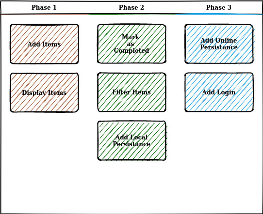

# To-do List 

The project involves developing a simple web-based to-do list application that allows users to add tasks, view them in a list, and mark them as completed

## Base Features to be Developed: 

 

-----

### Phase 1:
In this phase, we develop the basic features for managing a to-do list.

- **Add Items to the List:** 
  - **Description:** Users can add new items to their to-do list.
  
- **Display Items Added to the List:**
  - **Description:** The app displays all items that have been added to the list.

### Phase 2:
This phase enhances the app with features that improve user experience.

- **Mark Items as Completed:**
  - **Description:** Users can mark items as completed, which will show the items with a strikethrough effect in the list.

- **Filter Items:**
  - **Description:** Users can filter the to-do list using a text field or by the status of the tasks.

- **Add Local Persistence:**
  - **Description:** All updates to the list are saved locally, ensuring the user's list is loaded as it was last updated upon reopening the app.

### Phase 3:
This phase introduces online capabilities to enhance accessibility and user convenience.

- **Add Login:**
  - **Description:** Users can create an account with a username and password, allowing them to access their list on any device.

- **Add Online Persistence:**
  - **Description:** Users can sync and access their to-do list across different devices when logged in.
